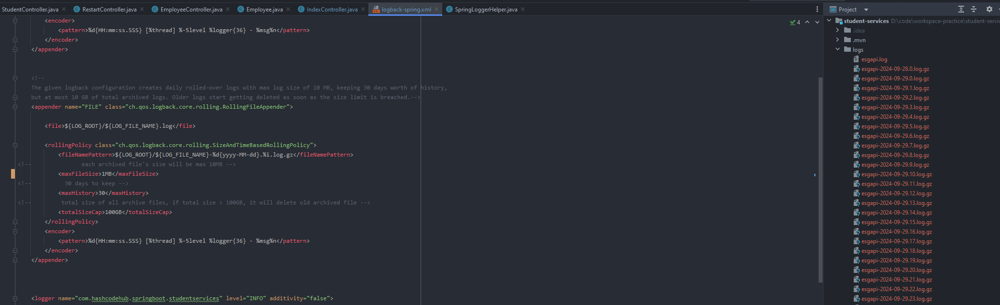
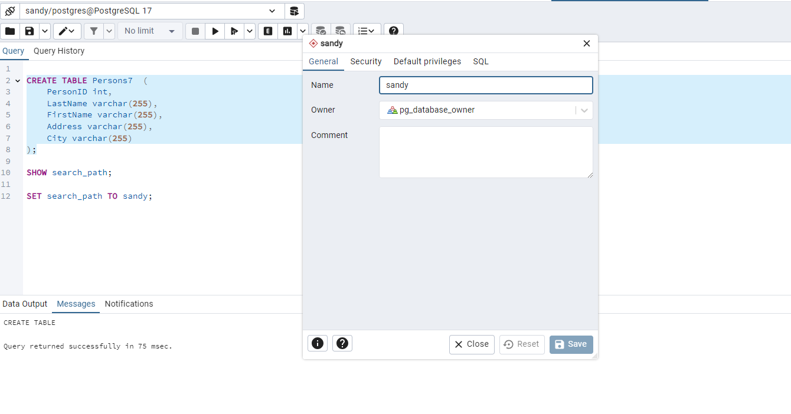

# SpringBoot Project with Integration Tests

### sample log file using logback-spring.xml

```xml
<?xml version="1.0" encoding="UTF-8"?>
<configuration>

    <property name="LOG_ROOT" value="logs"/>
    <property name="LOG_FILE_NAME" value="esgapi"/>


    <appender name="CONSOLE" class="ch.qos.logback.core.ConsoleAppender">
        <encoder>
            <pattern>%d{HH:mm:ss.SSS} [%thread] %-5level %logger{36} - %msg%n</pattern>
        </encoder>
    </appender>


    <!--
    The given logback configuration creates daily rolled-over logs with max log size of 10 MB, keeping 30 days worth of history,
    but at most 10 GB of total archived logs. Older logs start getting deleted as soon as the size limit is breached.-->
    <appender name="FILE" class="ch.qos.logback.core.rolling.RollingFileAppender">

        <file>${LOG_ROOT}/${LOG_FILE_NAME}.log</file>

        <rollingPolicy class="ch.qos.logback.core.rolling.SizeAndTimeBasedRollingPolicy">
            <fileNamePattern>${LOG_ROOT}/${LOG_FILE_NAME}-%d{yyyy-MM-dd}.%i.log.gz</fileNamePattern>
            <!--               each archived file's size will be max 10MB -->
            <maxFileSize>1MB</maxFileSize>
            <!--          30 days to keep -->
            <maxHistory>30</maxHistory>
            <!--         total size of all archive files, if total size > 100GB, it will delete old archived file -->
            <totalSizeCap>100GB</totalSizeCap>
        </rollingPolicy>
        <encoder>
            <pattern>%d{HH:mm:ss.SSS} [%thread] %-5level %logger{36} - %msg%n</pattern>
        </encoder>
    </appender>


    <logger name="com.hashcodehub.springboot.studentservices" level="INFO" additivity="false">
        <appender-ref ref="CONSOLE"/>
        <appender-ref ref="FILE"/>
    </logger>


</configuration>


```




#### Installing and configuring PostgresSql in local
1. Install postgresSql
2. password setup : 9595 
3. Step 2: Access PostgreSQL Command Line and Graphical Tools
4. Access psql (Command Line Tool):
   Open the PostgreSQL command line tool, psql, from the Start Menu or by navigating to the PostgreSQL installation directory. Log in using the postgres user and the password you set during installation.
   psql -U postgres
5. Access pgAdmin (Graphical Tool):
   Install and open pgAdmin – a popular graphical administration tool for PostgreSQL. Use it to manage databases, execute SQL queries, and perform other administrative tasks.

6. by default postgres will create one database and one schema 
7. you can create your own database and it will have one public schema -? problem is everything will be pushed to this public schema by default to fix this you need to modify the search_path and even before that your user should have all the permission which is accessing the schema

input 

```roomsql
SHOW search_path;

SET search_path TO sandy;
```



8. CREATE DATABASE your_database_name;
9. CREATE USER your_username WITH PASSWORD 'your_password';
10. GRANT ALL PRIVILEGES ON DATABASE your_database_name TO your_username;
11. start and stop the service
    `net start postgresql-x64-`
    `net stop postgresql-x64-`